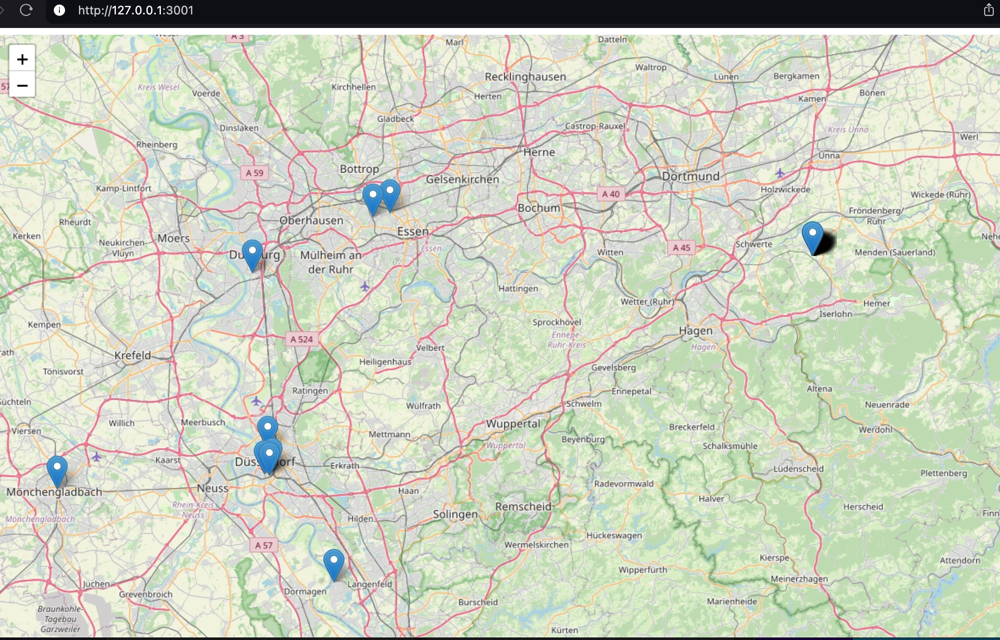

# German (Deutsch)

Das alles wurde mit Hilfe von ChatGPT aus Spaß entwickelt, um zu zeigen, welche Restaurants in NRW (Deutschland) bei früheren oder aktuellen Lebensmittelkontrollen aufgefallen sind. Die App sammelt dynamisch Daten vom offiziellen Portal für Lebensmitteltransparenz NRW, bereitgestellt durch das Landesamt für Natur, Umwelt und Verbraucherschutz Nordrhein-Westfalen (LANUV), und zeigt deren Standorte auf einer interaktiven Karte (OpenStreetMap) mit Leaflet an. Nutzer können Firmennamen und Adressen auf einer Karte einsehen, bei denen Kontrollen durchgeführt wurden. Da die Daten nicht zentral und maschinenlesbar vorliegen, wird ein Webscraper verwendet. Da die Daten nicht sauber und getrennt im maschinenlesbaren Format vorliegen, können nicht alle kontrollierten Unternehmen dargestellt werden.

Eine Anfrage, die Daten maschinenlesbar anzubieten, wurde bereits an die Präsidentin des LANUV per E-Mail am 15.10.2024 gestellt.

# English translation

All of this was developed with the help of ChatGPT just for fun, to show which restaurants in NRW (Germany) had past or current issues with food inspections. The app dynamically collects data from the official Food Transparency NRW portal, provided by the State Office for Nature, Environment, and Consumer Protection of North Rhine-Westphalia (LANUV), and displays their locations on an interactive map (OpenStreetMap) using Leaflet. Users can view business names and addresses on the map where inspections have been conducted. Since the data is not centrally available and machine-readable, a web scraper is used. Because the data is not clearly separated in a machine-readable format, not all inspected companies can be displayed.

A request to provide the data in a machine-readable format has already been sent to the president of LANUV via email on 15.10.2024.

